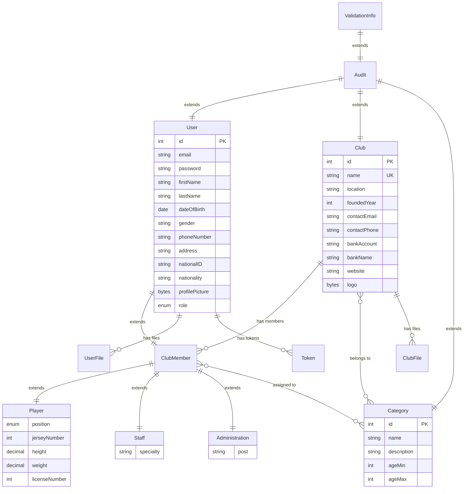

# 🏟️ MaFederation

> **A full-stack sports federation management platform** for managing clubs, players, staff, administration members, categories, and verification workflows — built with **Angular 20** and **Spring Boot 3.2**.

---

## 📋 Table of Contents

- [Overview](#overview)
- [Features](#features)
- [Tech Stack](#tech-stack)
- [Architecture](#architecture)
- [Data Model](#data-model)
- [API Endpoints](#api-endpoints)
- [Project Structure](#project-structure)
- [Getting Started](#getting-started)
  - [Prerequisites](#prerequisites)
  - [Backend Setup](#backend-setup)
  - [Frontend Setup](#frontend-setup)
- [Authentication & Security](#authentication--security)
- [User Roles & Permissions](#user-roles--permissions)
- [Deployment](#deployment)
- [Contributing](#contributing)
- [License](#license)

---

## Overview

**MaFederation** is a comprehensive web application designed to digitize and streamline the management of a sports federation. It provides a centralized platform where federation administrators can oversee all registered clubs, while club administrators manage their own players, staff, and administration members. The system includes robust verification workflows, role-based access control, audit logging, and file management capabilities.

---

## Features

### 🏢 Club Management
- Register, update, and view club profiles (name, location, contact info, bank details, website)
- Upload and manage club logos and documents
- Assign sport categories to clubs
- Club verification request workflow (pending → approved / rejected)

### ⚽ Player Management
- Add players with detailed profiles (position, jersey number, height, weight, license number)
- Medical records tracking
- Player statistics dashboard
- Assign players to sport categories
- Player verification workflow

### 👥 Staff Management
- Register staff members with specialty fields
- Staff profile management
- Category assignment

### 🛡️ Administration Management
- Manage club administrators with post/title information
- Full CRUD operations on administration members

### 📂 Category System
- Create and manage sport categories (name, description, age range)
- Assign categories to clubs and members
- Age-based filtering (min/max age)

### ✅ Verification Workflows
- **User Verification**: Federation admins approve or reject new user registrations
- **Club Verification**: Federation admins validate club registration requests
- Rejection reasons tracked for transparency

### 📊 Dashboard & Administration
- Federation-level admin dashboard
- Moderator management (add/remove mods)
- Club admin assignment
- Audit logs for tracking system activities
- Role and permission management

### 🔐 Security
- JWT-based authentication with refresh tokens
- Role-based access control (RBAC)
- Stateless session management
- Secure logout with token revocation

### 📁 File Management
- Upload and manage user documents (profile pictures, ID documents)
- Upload and manage club files (logos, official documents)
- File type categorization

---

## Tech Stack

### Backend
| Technology | Version | Purpose |
|---|---|---|
| **Java** | 21 | Programming language |
| **Spring Boot** | 3.2.5 | Application framework |
| **Spring Security** | 6.x | Authentication & authorization |
| **Spring Data JPA** | 3.x | Data persistence |
| **PostgreSQL** | Latest | Relational database |
| **Lombok** | Latest | Boilerplate reduction |
| **JJWT** | 0.11.5 | JWT token handling |
| **Jackson** | Latest | JSON serialization |
| **Maven** | 3.x | Build & dependency management |

### Frontend
| Technology | Version | Purpose |
|---|---|---|
| **Angular** | 20.0.0 | SPA framework |
| **TypeScript** | 5.8.x | Programming language |
| **RxJS** | 7.8.x | Reactive programming |
| **Angular SSR** | 20.0.3 | Server-side rendering |
| **Express** | 5.1.x | SSR server |
| **jwt-decode** | 4.0.0 | Client-side JWT decoding |
| **Font Awesome** | 6.4.0 | Icon library |
| **Material Icons** | Latest | Google Material icons |

---

## Architecture

```
┌─────────────────────────────────────────────────────────────────┐
│                        CLIENT (Browser)                         │
│                      Angular 20 SPA + SSR                       │
│  ┌──────────┐ ┌──────────┐ ┌──────────┐ ┌────────────────────┐  │
│  │   Club    │ │  Player  │ │  Staff   │ │    Dashboard       │  │
│  │  Module   │ │  Module  │ │  Module  │ │    (Admin)         │  │
│  └────┬─────┘ └────┬─────┘ └────┬─────┘ └────────┬───────────┘  │
│       └─────────────┴────────────┴────────────────┘              │
│                          │  HTTP/REST + JWT                      │
└──────────────────────────┼──────────────────────────────────────┘
                           │
┌──────────────────────────┼──────────────────────────────────────┐
│                   BACKEND (Spring Boot 3.2)                     │
│                          │                                      │
│  ┌───────────────────────▼───────────────────────────────────┐  │
│  │              REST Controllers (API v1)                    │  │
│  │  Auth │ Club │ Player │ Staff │ Admin │ Verification │File│  │
│  └───────────────────────┬───────────────────────────────────┘  │
│  ┌───────────────────────▼───────────────────────────────────┐  │
│  │                   Service Layer                           │  │
│  └───────────────────────┬───────────────────────────────────┘  │
│  ┌───────────────────────▼───────────────────────────────────┐  │
│  │              Mapper Layer (DTO ↔ Entity)                  │  │
│  └───────────────────────┬───────────────────────────────────┘  │
│  ┌───────────────────────▼───────────────────────────────────┐  │
│  │             Repository Layer (Spring Data JPA)            │  │
│  └───────────────────────┬───────────────────────────────────┘  │
│                          │                                      │
│  ┌───────────────────────▼───────────────────────────────────┐  │
│  │            Security (JWT Filter + Spring Security)        │  │
│  └───────────────────────────────────────────────────────────┘  │
└──────────────────────────┼──────────────────────────────────────┘
                           │
              ┌────────────▼────────────┐
              │    PostgreSQL Database   │
              │      "MaFederation"      │
              └─────────────────────────┘
```

---

## Data Model



### Inheritance Hierarchy

```
ValidationInfo (MappedSuperclass)
  └── Audit (MappedSuperclass) — id, createdAt, updatedAt, createdBy, updatedBy
        ├── User (Entity: users) — email, password, profile fields, role
        │     └── ClubMember (Entity: SINGLE_TABLE) — club, type, categories
        │           ├── Player — position, jerseyNumber, height, weight, licenseNumber
        │           ├── Staff — specialty
        │           └── Administration — post
        ├── Club (Entity: clubs) — name, location, members, categories, logo, files
        └── Category (Entity: categories) — name, description, ageMin, ageMax
```

---

## API Endpoints

### 🔑 Authentication (`/api/v1`)

| Method | Endpoint | Description | Access |
|--------|----------|-------------|--------|
| `POST` | `/register/admin` | Register a federation admin | Public |
| `POST` | `/register/ClubAdmin` | Register a club admin | Authenticated |
| `POST` | `/auth/authenticate` | Login (returns JWT) | Public |
| `POST` | `/auth/refresh-token` | Refresh access token | Public |
| `POST` | `/auth/logout` | Logout & revoke token | Authenticated |

### 🏢 Clubs (`/clubs`)

| Method | Endpoint | Description | Access |
|--------|----------|-------------|--------|
| `GET` | `/clubs` | List all clubs | ADMIN, CLUB_ADMIN |
| `GET` | `/clubs/{id}` | Get club by ID | ADMIN, CLUB_ADMIN |
| `POST` | `/clubs` | Create a new club | ADMIN |
| `PUT` | `/clubs/{id}` | Update club info | ADMIN, CLUB_ADMIN |
| `DELETE` | `/clubs/{id}` | Delete a club | ADMIN |

### ⚽ Players (`/players`)

| Method | Endpoint | Description | Access |
|--------|----------|-------------|--------|
| `GET` | `/players` | List players | ADMIN, CLUB_ADMIN |
| `POST` | `/players/addplayer` | Add a new player | CLUB_ADMIN |
| `PUT` | `/players/{id}` | Update player | CLUB_ADMIN |
| `DELETE` | `/players/{id}` | Remove player | CLUB_ADMIN |

### 👥 Staff (`/staff`)

| Method | Endpoint | Description | Access |
|--------|----------|-------------|--------|
| `GET` | `/staff` | List staff members | ADMIN, CLUB_ADMIN |
| `POST` | `/staff` | Add staff member | CLUB_ADMIN |
| `PUT` | `/staff/{id}` | Update staff member | CLUB_ADMIN |
| `DELETE` | `/staff/{id}` | Remove staff member | CLUB_ADMIN |

### ✅ Verification Requests

| Method | Endpoint | Description | Access |
|--------|----------|-------------|--------|
| `GET` | `/user-verifications` | List user verification requests | ADMIN |
| `PUT` | `/user-verifications/{id}` | Approve/reject user | ADMIN |
| `GET` | `/club-verifications` | List club verification requests | ADMIN |
| `PUT` | `/club-verifications/{id}` | Approve/reject club | ADMIN |

### 📊 Management (`/api/v1/management`)

| Method | Endpoint | Description | Access |
|--------|----------|-------------|--------|
| `GET` | `/api/v1/management/**` | Admin management endpoints | ADMIN |

---

## Project Structure

```
MaFederation/
├── backend/                              # Spring Boot Backend
│   ├── src/main/java/com/MaFederation/MaFederation/
│   │   ├── MaFederationApplication.java  # Main entry point
│   │   ├── config/                       # Configuration classes
│   │   │   ├── ApplicationConfig.java    # Beans & auth provider
│   │   │   ├── JwtAuthenticationFilter.java  # JWT filter
│   │   │   ├── LogoutService.java        # Token revocation
│   │   │   ├── SecurityConfiguration.java # Security rules
│   │   │   └── WebConfig.java            # CORS configuration
│   │   ├── controllers/                  # REST controllers
│   │   │   ├── auth/                     # Authentication endpoints
│   │   │   │   ├── AuthenticationController.java
│   │   │   │   ├── AuthenticationService.java
│   │   │   │   ├── AuthenticationRequest.java
│   │   │   │   ├── AuthenticationResponse.java
│   │   │   │   ├── RegisterRequest.java
│   │   │   │   └── ClubRegisterRequest.java
│   │   │   ├── ClubController.java
│   │   │   ├── PlayerController.java
│   │   │   ├── StaffController.java
│   │   │   ├── AdministrationController.java
│   │   │   ├── ModController.java
│   │   │   ├── UserFileController.java
│   │   │   ├── UserSelectionController.java
│   │   │   ├── UserVerificationRequestController.java
│   │   │   └── ClubVerificationRequestController.java
│   │   ├── dto/                          # Data Transfer Objects
│   │   │   ├── Admin/
│   │   │   ├── Category/
│   │   │   ├── Club/
│   │   │   ├── ClubMember/
│   │   │   ├── Player/
│   │   │   ├── RolePermission/
│   │   │   ├── Staff/
│   │   │   ├── User/
│   │   │   ├── VerificationRequestResponseDTO/
│   │   │   └── mod/
│   │   ├── enums/                        # Enumerations
│   │   │   ├── ClubFileType.java
│   │   │   ├── ClubMemberType.java
│   │   │   ├── Position.java             # GOALKEEPER, DEFENDER, MIDFIELDER, FORWARD
│   │   │   ├── RoleName.java             # ADMIN, USER, CLUB_ADMIN
│   │   │   ├── UserFileType.java
│   │   │   ├── ValidationStatus.java
│   │   │   └── VerificationTargetType.java
│   │   ├── mappers/                      # Entity ↔ DTO mappers
│   │   ├── model/                        # JPA entities
│   │   │   ├── ValidationInfo.java       # Base: validation fields
│   │   │   ├── Audit.java                # Base: id, timestamps
│   │   │   ├── User.java                 # User entity (Spring Security)
│   │   │   ├── ClubMember.java           # Abstract club member
│   │   │   ├── Player.java
│   │   │   ├── Staff.java
│   │   │   ├── Administration.java
│   │   │   ├── Club.java
│   │   │   ├── Category.java
│   │   │   ├── Token.java
│   │   │   ├── Logs.java
│   │   │   ├── ClubFile.java
│   │   │   ├── UserFile.java
│   │   │   ├── ClubVerificationRequest.java
│   │   │   └── UserVerificationRequest.java
│   │   ├── repository/                   # Spring Data repositories
│   │   └── services/                     # Business logic
│   ├── src/main/resources/
│   │   └── application.yml               # App configuration
│   └── pom.xml                           # Maven dependencies
│
├── frontend/                             # Angular 20 Frontend
│   ├── src/
│   │   ├── app/
│   │   │   ├── app.ts                    # Root component
│   │   │   ├── app.html                  # Root template (sidebar + router)
│   │   │   ├── app.css                   # Global app styles
│   │   │   ├── app.routes.ts             # Route definitions
│   │   │   ├── app.config.ts             # App configuration
│   │   │   ├── Club/                     # Club feature module
│   │   │   │   ├── add-club-component/
│   │   │   │   ├── club-card-component/
│   │   │   │   ├── club-categories/
│   │   │   │   ├── club-component/
│   │   │   │   └── list-clubs-component/
│   │   │   ├── Player/                   # Player feature module
│   │   │   │   ├── add-player-component/
│   │   │   │   ├── list-players-component/
│   │   │   │   ├── player-component/
│   │   │   │   ├── player-medical-component/
│   │   │   │   └── player-stats-component/
│   │   │   ├── Staff/                    # Staff feature module
│   │   │   │   ├── add-staff-component/
│   │   │   │   ├── list-staff-component/
│   │   │   │   └── staff-component/
│   │   │   ├── Adminstration/            # Administration module
│   │   │   │   ├── add-adminstration-component/
│   │   │   │   ├── adminstration-component/
│   │   │   │   └── list-adminstration-component/
│   │   │   ├── Dashboard/                # Admin dashboard module
│   │   │   │   ├── add-club-mod/
│   │   │   │   ├── add-mod-component/
│   │   │   │   ├── admin-type.component/
│   │   │   │   ├── audit-logs/
│   │   │   │   ├── club-mods.component/
│   │   │   │   ├── club-verification/
│   │   │   │   ├── mod-component/
│   │   │   │   ├── mods-component/
│   │   │   │   └── user-verification/
│   │   │   ├── User/                     # User & login module
│   │   │   ├── Role/                     # Role & permissions
│   │   │   ├── categories/               # Category management
│   │   │   ├── nav/                      # Navigation components
│   │   │   │   ├── admin/                # Admin sidebar nav
│   │   │   │   └── club/                 # Club sidebar nav
│   │   │   ├── services/                 # Angular services
│   │   │   │   ├── api/                  # API service clients
│   │   │   │   └── auth-interceptor/     # HTTP interceptor for JWT
│   │   │   ├── representations/          # Shared UI representations
│   │   │   └── files/                    # File handling components
│   │   ├── index.html                    # Entry HTML
│   │   ├── main.ts                       # Bootstrap
│   │   ├── main.server.ts                # SSR bootstrap
│   │   ├── server.ts                     # Express SSR server
│   │   ├── styles.css                    # Global styles
│   │   └── custom-theme.scss             # Custom theme
│   ├── angular.json                      # Angular CLI config
│   ├── vercel.json                       # Vercel deployment config
│   ├── package.json                      # NPM dependencies
│   └── tsconfig.json                     # TypeScript config
│
└── README.md                             # This file
```

---

## Getting Started

### Prerequisites

| Requirement | Version |
|---|---|
| **Java JDK** | 21+ |
| **Node.js** | 20+ |
| **npm** | 10+ |
| **PostgreSQL** | 14+ |
| **Maven** | 3.8+ |
| **Angular CLI** | 20.x |

### Backend Setup

1. **Clone the repository**
   ```bash
   git clone https://github.com/Bechir-98/MaFederation.git
   cd MaFederation
   ```

2. **Create the PostgreSQL database**
   ```sql
   CREATE DATABASE "MaFederation";
   ```

3. **Configure the database connection**

   Edit `backend/src/main/resources/application.yml`:
   ```yaml
   spring:
     datasource:
       url: jdbc:postgresql://localhost:5432/MaFederation
       username: your_username
       password: your_password
   ```

4. **Run the backend**
   ```bash
   cd backend
   ./mvnw spring-boot:run
   ```
   The API server will start on **`http://localhost:8080`**.

   > **Note:** JPA is configured with `ddl-auto: update`, so tables will be created/updated automatically on first run.

### Frontend Setup

1. **Install dependencies**
   ```bash
   cd frontend
   npm install
   ```

2. **Start the development server**
   ```bash
   npm start
   ```
   The Angular app will be available at **`http://localhost:4200`**.

3. **Build for production**
   ```bash
   npm run build
   ```
   The production build will be output to `dist/fed/browser`.

---

## Authentication & Security

### JWT Flow

```
1. User sends POST /api/v1/auth/authenticate with email & password
2. Server validates credentials and returns:
   ├── access_token (expires in 1 hour)
   └── refresh_token (expires in 1 hour)
3. Client stores token in localStorage
4. Client sends Authorization: Bearer <token> on subsequent requests
5. JwtAuthenticationFilter validates token on every request
6. On logout, token is revoked server-side
```

### Security Configuration

- **Public endpoints**: `/api/v1/auth/**`, `/api/v1/register/admin`
- **Admin-only**: `/api/v1/management/**`
- **ADMIN + CLUB_ADMIN**: `/user/**`, `/clubs/**`
- **CLUB_ADMIN only**: `/players/addplayer`
- **All other endpoints**: Require authentication

---

## User Roles & Permissions

| Role | Description | Permissions |
|------|-------------|-------------|
| **ADMIN** | Federation administrator | Full system access — manage clubs, users, verifications, mods, categories, audit logs |
| **CLUB_ADMIN** | Club administrator | Manage own club — add/edit players, staff, admins; manage club files and categories |
| **USER** | Standard user | Basic authenticated access |

### Navigation

The application dynamically renders different sidebar navigations based on the user's role:

- **ADMIN** → `AdminNavComponent` (federation-level navigation)
- **CLUB_ADMIN / USER** → `ClubNavComponent` (club-level navigation)
- **Unauthenticated** → Login page only (no sidebar)

---

## Deployment

### Frontend (Vercel)

The frontend is pre-configured for deployment on **Vercel** with the included `vercel.json`:

```bash
cd frontend
npx vercel --prod
```

Configuration details:
- **Build output**: `dist/fed/browser`
- **SPA routing**: All routes fallback to `index.html`

### Backend

The backend can be deployed as a standard Spring Boot JAR:

```bash
cd backend
./mvnw clean package -DskipTests
java -jar target/MaFederation-0.0.1-SNAPSHOT.jar
```

> **Important**: Update `application.yml` with production database credentials and a secure JWT secret key before deploying.

---

## Contributing

1. **Fork** the repository
2. **Create** a feature branch (`git checkout -b feature/amazing-feature`)
3. **Commit** your changes (`git commit -m 'Add amazing feature'`)
4. **Push** to the branch (`git push origin feature/amazing-feature`)
5. **Open** a Pull Request

---

## License

This project is open source. See the repository for license details.

---

<p align="center">
  Built with ❤️ using <strong>Angular 20</strong> & <strong>Spring Boot 3.2</strong>
</p>
